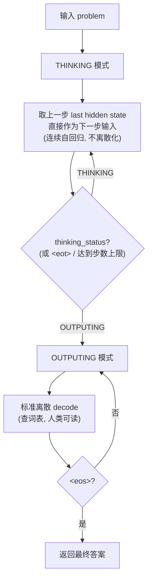

# Fuzzy Deep Thinker：把"慢思考"放进连续空间的假设、分析与实验设计

> Source: Feishu attachment imported from `/home/zlong/_feishu_attachments/20260627-103621-18d8846140-fuzzy_deep_thinker.md`.
>
> Status: 原始研究笔记 / 理论草案。它保留了较完整的思想展开，包括 RL、`thinking_status` 门控、ELF 式连续 loss 等远期方向；当前 repo 的可执行实验范围以 `README.md`、`README.zh-CN.md`、`docs/RESEARCH_RATIONALE_ZH.md` 和具体 phase/run 文档为准。
>
> Imported: 2026-06-27.

> 本文是一份研究笔记 / 实验设计草案。核心目的是：把一个 insight 写清楚，分析它在理论上是否可能成立，并设计一套**不改变模型主干结构**就能验证的实验。

> **命名说明**："Fuzzy"（模糊/连续）对应本文核心——让思考 token 不再被钉死在离散词表上，而是"模糊地"停留在连续 embedding 空间；"Deep Thinker"指深度慢思考（long thinking）。合起来即"连续空间里的深度思考者"。

## TL;DR（摘要）

- **现象**：AR 大模型（DeepSeek、Opus 4.8 等）的长链慢思考确实有效，但**思考过程用离散 token + 写成人话来承载，噪声大、表达效率不一定高**。
- **假设**：思考段（thinking）人类无需逐字阅读，可像何恺明 ELF 那样 relax 到**连续 embedding 空间**、**只对最终输出段（output）解码到离散词表**；这能提升慢思考的表达带宽与效率。该假设含两个可分别检验的子命题：**(H1) 能力**——单位思考 token 表达力更强；**(H2) 效率**——达到同等准确率所需思考 token 更少。
- **两篇文献夹击支撑**：**ELF**（连续表达更强、延迟离散，给出损失范式）+ **Position 论文**（中间 token 本无可靠人类语义，拆掉"必须离散/像人话"的约束）；**Coconut / Soft Thinking** 提供 AR 范式下的存在性证据。
- **做法**：不改主干，引入 `thinking_status ∈ {THINKING, OUTPUTING}` 作为**训练期 loss 开关**兼**推理期"何时停止思考"的门控**，据此设计差异化 loss 并与全离散基线强对照。
- **成败关键**：思考段如何获得**有效监督信号又不退化为模仿 teacher**——其中 RL（仅用最终结果奖励）最干净，因为它直接绕过"连续 target 从哪来"的难题。

---

## 0. 文档说明与参考来源

本文研读的两篇参考文献（两篇微信公众号文章分别在解读它们）：

- **参考文献 A（连续表达侧）**：**ELF: Embedded Language Flows**。Keya Hu, Linlu Qiu, Yiyang Lu, Hanhong Zhao, Tianhong Li, Yoon Kim, Jacob Andreas, **Kaiming He**（MIT，2026）。arXiv: 2605.10938，代码: <https://github.com/lillian039/ELF>。对应微信文章 <https://mp.weixin.qq.com/s/D4pve6rNks88o_aJ9Q1qcQ>。
- **参考文献 B（思维链质疑侧）**：**Position: Stop Anthropomorphizing Intermediate Tokens as Reasoning/Thinking Traces!**。Subbarao Kambhampati 等（Arizona State University，NeurIPS 2025 CogInterp Workshop）。arXiv: 2504.09762。对应微信文章 <https://mp.weixin.qq.com/s/RyuLfX29ZZP535uXveitug>。

> 说明：两个微信链接本身因公众号环境验证无法直接抓取正文，但已定位到它们解读的原始论文，本文以两篇**原始论文**为准进行分析（要点见"附录 A"）。这两篇文献恰好从两个互补角度支撑本文假设：ELF 提供"连续 embedding 表达力更强、只在最后一步离散"的**正面技术证据与可借用的损失设计**；Position 论文则从"中间 token 没有可靠的人类语义"出发，**为'让思考 token 脱离词表、进入连续空间'提供了理论正当性**。

---

## 1. 灵感来源（Motivation）

这个想法的直接灵感来自**何恺明团队的连续 embedding 语言生成工作 ELF（Embedded Language Flows）**。

其核心贡献可以概括为一句话：

> **连续的 embedding 空间，其表达能力强于离散的（被量化到固定 vocabulary 的）embedding 空间——只要不在中途反复做离散化。**

**ELF 在做什么**：当前主流的扩散语言模型（DLM）大多在**离散 token 空间**上运作；ELF 反其道而行，用连续时间的 **Flow Matching**，让整个去噪（denoising）过程**始终停留在连续 embedding 空间**，**只在最后一个时间步**（t=1）才用一个共享权重网络把连续向量映射回离散词表（无需单独的 decoder）。

**ELF 的关键论断（对本文最重要）**：以往连续 DLM 表现不佳，**不是因为语言天然不适合连续建模，而是因为它们在每一步去噪中途都做了离散化（rounding / 逐 token 交叉熵），打断了"流"的连续性**。ELF 把离散化推迟到最后一步，保住连续性，于是：(i) 生成质量显著优于当时领先的离散与连续 DLM；(ii) 采样步数更少；(iii) 训练 token 量少约 10×；(iv) 还能直接借用图像扩散里成熟的 **Classifier-Free Guidance (CFG)**。

**关键启示**：离散化（discretization / quantization）是一种**有损压缩**，而且**反复中途离散化会破坏连续表示的优势**。当下游任务**不强制要求人类可读的离散符号**时，把表示放在连续空间里、尽量推迟离散化，往往能保留更多信息、获得更强的表达能力。

> 这个启示能否迁移到 LLM 的"思考过程（thinking process / slow thinking）"？——把"思考段"看成 ELF 里"中途不必离散化的部分"，只在"输出段"才离散化。这就是本文的核心假设。

### 1.1 适用范围与跨范式假设（重要前提）

需要先讲清楚本文讨论的对象与一个隐含假设：

- **目标模型是自回归（AR）Transformer**，即 DeepSeek、Opus 4.8 这类逐 token 自回归生成的大模型——这才是我们日常用于慢思考/编程的主力，也是本文实验真正要改进的对象。
- **而 ELF 属于 diffusion / Flow Matching 语言模型（非自回归）范式**。因此 ELF 的结论不能直接照搬，二者在生成机制上有本质差异。
- **本文的跨范式假设**：ELF 揭示的"**连续 embedding 空间表达能力更强、且不应中途反复离散化**"这一性质，**很可能是表示层面的、与具体生成范式（diffusion vs autoregressive）相对独立的规律**，因而在 AR Transformer 的思考过程上同样可能成立。换言之，我们借用的不是 ELF 的扩散采样机制，而是它关于"连续 > 离散、延迟离散化"的**表示性结论**。
- **为什么这个跨范式迁移并非空想**：恰好有 AR 侧的直接旁证——**Coconut、Soft Thinking 都是在自回归 Transformer 上**把思考放进连续/概念空间并取得增益（详见 3.1、附录 B）。它们说明"连续思考"这件事在 AR 范式里本身能 work；ELF 则在生成质量与损失设计上进一步佐证了"连续表示+延迟离散"的价值。
- **但必须把它当作一个待验证的假设而非既定事实**：扩散模型天然在连续空间迭代去噪，AR 模型则是逐步条件生成、更易受误差累积影响，迁移是否真的成立、收益多大，需要由第 4 节的实验来证伪/证实（亦见 3.2 的风险讨论）。

### 1.2 关键澄清：AR 自回归里其实存在"两种"离散化损害

针对两个尖锐问题——"AR 反馈传的是 hidden 向量而非文本，算不算反复离散化？"以及"即便不反复离散化，逐 token CE 对齐离散 GT 是否仍有害？"——需要把**前向反馈**与**训练监督**两条路径分开看，它们是两种不同的离散化损害。

**先纠正一个常见误解**：标准 AR 在每一步的反馈**不是**把连续 hidden 直接传下去，而是

```
h_t (连续, ∈ R^d) → lm_head → logits → argmax/采样 → 离散 token id → 查 embedding 表 → 下一步输入向量
```

传给下一步的"向量"虽是 embedding 向量，但它**只能是词表里 |V| 个固定向量之一**，是被 argmax/采样**量化**后再查表得到的，携带信息量被压到约 log₂|V| ≈ 17 bit；而 h_t 本身容量是 d×(每维比特) ≈ 几千 bit。**"是向量"不等于"连续"——一个被 one-hot 选中的固定向量，本质仍是离散符号。** 所以标准 AR 推理时**确实存在逐步的离散化瓶颈**。Coconut / 本文方案 D 正是把这步换成"直接反馈原始连续 `h_t`"，绕过 argmax→查表。

**于是有两种相互独立的离散化损害：**

- **损害 (A)：前向 / 反馈瓶颈**。每步 `h_t` 被挤过一个离散 token 再 re-embed，链条上反复发生 → "信息带宽"问题：丰富、可能多峰/含不确定性的思维状态被压成单一离散选择。**靠"连续反馈 hidden"消除（表示轴）。**
- **损害 (B)：监督对齐到离散 GT**。即便前向完全连续，训练时若仍对每个思考 token 做交叉熵、对齐 one-hot 的离散 GT，**监督信号本身仍是离散的**：它强令"这一步思考必须等于某个特定词表项" → "目标过约束"问题：把本可多样的思维状态空间，钉死到一条任意选定的离散轨迹。**靠"思考段不做 CE / 改连续 loss / 只用最终 reward"消除（loss 轴）。**

> **预防一个反驳**："Transformer 的 self-attention 不是已经能让后面的位置读到前面位置的连续 K/V 吗，何来瓶颈？" ——注意区分"复用过去的连续计算"与"每一步新注入的信息"。attention 确实能让后续位置读取过去位置的连续 K/V，但**每个新自回归步向序列中"新提交"的外部信息，仍被限制为一个离散 token**（该位置的输入嵌入只能是某个词表项）。瓶颈就发生在这个"新提交"通道上：模型每一步只能把它丰富的 `h_t` 压成 1 个离散选择交出去。方案 D 的改动正是让这一步的"新提交"变成完整连续的 `h_t`。

**回答第二个问题：是的，(B) 是一种独立、且对"思考段"尤其有害的损害。** 原因正是参考文献 B（Position 论文）的核心证据：思考 trace **没有唯一正确答案**——打乱/噪声/无关 trace 也能得到正确结果，trace 与答案只松散相关。既然如此，用 CE 把思考段对齐到某条具体离散轨迹，就是**强加一个并不必要、且信息量仅 17 bit/步的人造 GT**，既限制表达力，又可能把模型推离它自己更优的内部表示（退化为"模仿这条特定 trace 的字面"）。

**为什么输出段不受此困扰（反而要保留离散）**：输出段的离散是**特性而非缺陷**——我们确实想要一个特定的、人类可读的答案，离散 token 是与人类的接口，CE 对齐离散 GT 在这里完全恰当。损害 (A)(B) 只在"人类无需逐字阅读、且无唯一正确轨迹"的**思考段**才成立。这正是本文"思考段连续、输出段离散"切分的根本理由。

**对实验设计的意义（两条轴 → 2×2 消融）**：B0 基线**同时**背负 (A) 和 (B)；完全连续思考（方案 D 的连续反馈 + 方案 B/C/E 的非 CE 监督）**同时**去掉两者。建议把消融显式拆成 2×2，以分别归因：

| | 思考段 CE 监督（有损害 B） | 思考段非 CE 监督（去损害 B） |
|---|---|---|
| **离散反馈（有损害 A）** | B0（传统全 decode） | 方案 B（仅 mask 掉思考段 CE） |
| **连续反馈（去损害 A）** | 连续反馈但仍 CE 对齐（诊断格，见下） | 方案 D + C/E（完全连续，核心） |

> 注："连续反馈但仍 CE 对齐"这一格看似矛盾（连续 hidden 反馈、却又要 decode 算 CE），它的价值是**纯诊断**：用于隔离"到底是反馈离散化 (A) 还是监督离散化 (B) 在拖累思考"——这是单看一个总指标无法区分的。

---

## 2. 核心洞见 / 假设（Insight & Hypothesis）

把上面的启示套到大模型的推理上，可以分四点来陈述。

### 2.1 思考过程的序列表达可能存在很大噪声

- 参考文献 B（Position 论文）正是"质疑思维链"这一派：它主张把中间 token（intermediate tokens / ITG）拟人化为"推理"或"思考"是 (1) 一厢情愿、(2) 缺乏实证、(3) 制造虚假信心、(4) 把研究带向歧途。**我并不完全认同把 CoT 说成"无效/无意义"的强结论**，但它确实用大量证据揭示了一个对本文极关键的事实：
- **中间 token 的"人类语义"是不可靠的**：该论文综述的多项研究表明——用**打乱的 / 噪声的 / 无关的 trace** 训练，模型最终答案的准确率竟能持平甚至提升（如 Valmeekam 等"Beyond semantics"、Dualformer、Li 等"structure not content"）；trace 的正确性与最终答案正确性只有松散相关；RL（GRPO）后训练在提升准确率的同时反而降低 trace 的语义正确性。
- 引申出本文的判断：**当前 thinking process 用"离散 token 序列 + 强行写成像人话"来承载，本身带有很大 noise，单位 token 的真实信息含量/表达效率不一定高**。模型被迫把内部、可能本是连续的"思维状态"投影到固定词表、还要"说得像人"，每一步都做一次有损且受约束的离散化，链条越长，累积噪声越大。
- 更妙的是：Position 论文的"行动号召"（Section 6）几乎是本文假设的直接背书——它写道，一旦不再要求中间 token 对人类可解释，就**可以只为"最终答案正确率"去优化中间 token，哪怕它们不再像人话**；甚至"可以让中间 token 是 embedding 空间里的任意向量、不必对应某个词表项"，并指出已有证据（它引用了 Coconut、Soft Thinking）表明这类做法能进一步提升准确率。**也就是说，'质疑思维链'这一派，逻辑终点恰恰是'把思考 relax 到连续空间'。**

### 2.2 但长序列思考对复杂问题确实有效（不可辩驳的经验事实）

- 我们每天用 Opus 之类的模型编程，**long thinking / long sequence 对解决复杂问题的实际效果是不可辩驳的**。
- 所以问题不是"要不要思考"，而是**"当前的思考过程效率偏低，可能有改进空间"**。
- 结论：不要否定慢思考，而要让慢思考**更高效、表达力更强**。

### 2.3 核心猜想：让"思考 token"进入连续空间，只对"输出 token"解码到离散词表

- 当前 LLM 把所有 token 都限定在 **discrete token 空间**（固定 vocabulary）。
- 但在 thinking process 这一段，**人类并不需要逐字理解模型复杂的内部思维过程**。
- 那么是否可以像何恺明的工作一样，把**思考阶段的 token 表示 relax 到连续空间**，让它们承载更丰富、更高带宽的信息；
- **只有最终输出 action / answer 的 token 才 decode 到离散 vocabulary**，供人类阅读。

> **假设（Hypothesis）**：允许 deep thinking 的 token 处于连续空间，可以增强 slow-thinking token 的表达能力，从而增强模型整体的复杂问题求解能力。
>
> 拆成两个可分别证伪的子命题：
> - **H1（能力）**：在相同思考长度下，连续思考的最终准确率更高（连续表示承载了更多有用信息）。
> - **H2（效率）**：达到相同准确率所需的思考步数/算力更少（更高的"思考带宽"换来更短的链）。
>
> 二者只要有一个成立，假设即获部分支持；两者皆不成立才算证伪（判据见 5.3）。

直觉类比：
- 离散 token = 把思维"说出声"，受限于语言词表带宽；
- 连续 thinking token = 让思维"在脑子里以高维向量流动"，不受词表瓶颈，只在需要对外表达时才"翻译成语言"。

### 2.4 关键工程约束：不改变模型主干结构，靠训练目标做实验

这点很重要——本假设的设计哲学是 **"最小改动、可证伪"**：

- **A）增加一个输出信号：`thinking_status ∈ {THINKING, OUTPUTING}`**，用来标记当前处于"思考段"还是"对外输出段"。
- **B）在 SFT 或 RL 训练时，根据 `thinking_status` 选择不同的 loss 计算策略**，例如：
  - 思考段：**不做 decode，直接在 embedding（连续）空间上计算 loss**；或
  - 思考段：**THINKING token 不计入 loss**（让它自由演化）；或
  - 思考段：用更"软"的目标（蒸馏 / 表征对齐 / 连续分布建模）替代逐 token 的交叉熵。
- **C）对比实验**：把上面的"连续思考"模型，与"传统每个 token 都 decode、都算交叉熵 loss"的模型，在同一数据、同一算力预算下对比最终效果。

---

## 3. 这个假设是否可能成立？（理论与可行性分析）

下面分别从"支持的论据"、"反对/风险"、"与已有工作的关系"三方面分析。

### 3.1 支持假设成立的论据

1. **信息论 / 有损压缩视角**：离散化是有损的。若思考段不需要人类可读，强行离散化只会丢信息。连续向量（如 1 个 4096 维 bf16 向量）的信息容量远高于 1 个 ~10⁵ 词表的离散 token（约 17 bit）。理论上连续 thinking token 的"思考带宽"高几个数量级。
2. **ELF 的技术证据（参考文献 A，注意是跨范式借用）**：ELF 证明在语言生成中，**全程停留连续 embedding、只在最后一步离散**，能比离散与连续 DLM 都更好（质量更高、步数更少、训练 token 少约 10×），并指出此前连续方法之所以差是**中途反复离散化**所致。ELF 本身是 diffusion 范式，但我们借用的是其**表示层面的结论**（连续 > 离散、延迟离散化），并假设它对 AR Transformer 同样成立（见 1.1）。迁移到推理：思考段就相当于"中途不该被离散打断的部分"，输出段才是"最后一步离散"。
3. **Position 论文的语义证据（参考文献 B）**：既然中间 token 的人类语义不可靠、且用噪声/无关 trace 也能保持甚至提升准确率，那么**强行让思考段对应词表项就是不必要的约束**；放开到连续空间，反而可能更贴近模型"真正在做的计算"。该论文亲自把"让中间 token 成为任意 embedding 向量"列为合乎逻辑的方向。
4. **AR 侧的直接存在性证据——Coconut（Chain of Continuous Thought, Meta 2024）与 Soft Thinking（2025）**：这两项**都在自回归 Transformer 上**完成，正好补上 ELF（diffusion 范式）与本文目标（AR 模型）之间的跨范式缺口。Coconut 直接把上一步的**最后隐藏状态作为下一步输入的 embedding**（不 decode 成离散 token），即"在连续潜空间里推理"，在部分逻辑推理任务上优于离散 CoT，并体现"宽度搜索"式并行推理；Soft Thinking 在"连续概念空间"做思考亦报告了增益。**这两项是本文假设在 AR 范式下最直接的存在性证据：连续思考至少在某些任务上确实 work，且恰被 Position 论文引用为支撑。**
5. **与 latent reasoning / soft prompt 谱系一致**：soft prompt、prefix tuning、各类 latent-thought 方法都说明"连续向量可以承载有用的、可被 Transformer 利用的语义/控制信息"。

### 3.2 反对意见与主要风险

1. **离散性也是一种有益的正则 / 抗误差累积机制**：每步 decode 到词表，相当于把状态"投影回流形上"，能抑制误差累积；纯连续自回归可能产生**漂移（drift）**，长链条下误差滚雪球。
2. **训练目标难定义（最核心难点）**：离散 token 有现成的交叉熵监督信号；连续 thinking token **"对什么算 loss"是开放问题**。
   - "THINKING token 不算 loss" → 监督信号变稀疏，思考段可能学不出有意义的结构（容易塌缩成无意义向量或捷径）。
   - "在 embedding 空间直接算 loss" → 需要一个 target embedding，但**思考过程通常没有 ground-truth 中间表示**；强行用 teacher 的隐藏态对齐又会把"思考"退化成"模仿 teacher 的激活"。
   - **ELF 给了一个可借鉴的答案**：它在连续空间用**去噪 MSE 损失（`L_MSE`，x-prediction）**作为主目标，仅在解码（decoding）模式才用交叉熵 `L_CE`，并以一个"去噪模式概率"（约 0.8）在两种模式间混合。这提示：思考段可用"连续去噪/重构式"目标取代逐 token 交叉熵——见方案 C2。但要注意 ELF 的连续 target 来自"对干净 embedding 加噪再去噪"这一自监督构造（target = 干净 token embedding），而推理思考段并没有这样的干净 target，因此仍需设计（见方案 C 的讨论与第 7 节开放问题）。
3. **可解释性 / 可控性下降**：连续思考是黑箱，难以审计、难做安全对齐、难调试。这是实际部署的硬约束。
4. **梯度/优化路径问题**：Coconut 类方法的训练通常需要 **curriculum（逐步把离散步替换成连续步）** 才稳定，直接端到端训练容易不收敛。
5. **"链式思考无效"反方证据的另一种解读**：如果某些任务里 CoT 收益本就有限，那连续思考能改善的上限也可能有限——收益可能高度任务相关（逻辑/规划类受益大，知识检索类受益小）。
6. **跨范式迁移本身就是一个假设（见 1.1）**：ELF 的优势来自 diffusion 的连续迭代去噪；AR 模型是逐 token 条件生成，更易误差累积，且没有 ELF 那种"对干净 embedding 加噪"得到的天然连续 target。"连续表达更强"在 AR 推理上**能否同等成立、收益是否被误差累积抵消**，是必须由实验回答的核心不确定性之一。

### 3.3 阶段性判断

> **结论：假设"在原则上可能成立，且已有较强的旁证（ELF 在生成侧、Coconut/Soft Thinking 在推理侧、Position 论文在语义/正当性侧三方面互证）"，但其成败几乎完全取决于"思考段的训练目标如何设计"。**

两篇参考文献正好提供了"假设的两条腿"：ELF 说明**连续表示+延迟离散**在技术上行得通、并给出损失设计范式；Position 论文说明**思考 token 本就不需要人类语义**，从而拆掉了"必须离散/必须像人话"的约束。剩下的核心不确定性是 **3.2 第 2 点（连续思考段如何获得有效监督信号、又不退化为模仿 teacher）**，实验必须围绕它来设计消融。因此本文实验设计的重心，不在"改结构"，而在 **"thinking_status 驱动的差异化 loss"**——恰好对应作者提出的 A/B/C 三点。

---

## 4. 实验设计（Experiment Design）

设计原则：**不改主干、可证伪、强对照、从小做起**。

### 4.0 统一记号与设置

- 序列被切成两类段：思考段（`THINKING`）与输出段（`OUTPUTING`）。
- 训练样本格式：`<problem> <bot> ...thinking... <eot> <answer> ...output... <eos>`，其中 `<bot>/<eot>` 标记思考段边界。
- `thinking_status` 既可由特殊 token（`<bot>/<eot>`）隐式给出，也可作为模型一个**额外的二分类输出头**显式预测（对应作者方案 A）。
- 统一对照基线 **B0**：标准做法，所有 token（含思考段）都 decode 到词表并计算交叉熵。
- 所有方案在**同一基座模型、同一数据、同一算力预算（相同 token 预算 / 相同 wall-clock）**下对比，保证公平。

**推理（inference）流程**（连续思考模型如何实际运行，澄清"何时停止思考"）：

1. 读入 problem，进入 **THINKING 模式**：每一步取上一步 Transformer 的 last hidden state，**不经过 argmax/采样到离散 token、不查 embedding 表，直接当作下一步输入**（连续自回归）。
2. **何时停止思考由 `thinking_status` 门控决定**：当 `thinking_status` 头预测翻转为 `OUTPUTING`（或显式生成 `<eot>`）时，切到 **OUTPUTING 模式**。这正是 `thinking_status` 的第二重作用——它不只是训练期的 loss 开关，也是**推理期的"思考预算控制器"**（可设上限步数兜底防止无限思考）。
3. **OUTPUTING 模式**：恢复标准离散自回归，正常 decode 出人类可读的答案，直到 `<eos>`。

> 含义：连续思考段对外完全不可见（无可读 token），用户只看到最终输出段；思考算力可由门控自适应或人为设上限，对应 H2 的效率检验。

**流程图**（连续思考 + `thinking_status` 门控）：



### 4.1 方案 A：显式 `thinking_status` 输出头（最小改动，先验证可分离性）

**目的**：先验证"让模型自己知道何时在思考、何时在输出"是否有害/有益，并为后续差异化 loss 打基础。

- 在原模型上加一个轻量二分类头，预测每个位置的 `thinking_status ∈ {THINKING, OUTPUTING}`。
- 主干语言建模 loss 不变（仍全 decode），额外加一个小权重的 `status` 分类 loss。
- **不引入连续思考**，纯粹作为脚手架 + 健全性检查。同时这个头将复用为后续方案的**推理期门控**（见 4.0 推理流程）与**训练期 loss 开关**，所以先把它训稳。

**预期/判读**：若加 status 头几乎不损害基础性能、且能准确预测思考/输出边界 → 说明分段标注与门控可行，可进入方案 C/D。

### 4.2 方案 B：思考段"不算 loss"（Free Thinking Tokens）

对应作者方案 B 的第二种策略。

- 训练时：`OUTPUTING` 段照常算交叉熵；`THINKING` 段的 token **不计入语言建模 loss**（mask 掉）。
- 思考段 token 仍可以是离散采样，也可以让其隐藏态直接作为下一步输入（见方案 D 才真正连续）。
- 这是"放松监督"的最简形式。

**风险**：监督过稀疏，思考段可能学不出结构。需配合 RL（见方案 E）给思考段提供**最终结果驱动**的信号。

### 4.3 方案 C：思考段在连续空间算 loss（Embedding-Space Loss）

对应作者方案 B 的第一种策略（"不做 decode，直接在 embedding 空间算 loss"）。难点在于 target 从哪来，给出三个子方案：

- **C1 自蒸馏对齐**：用一个 teacher（可以是同模型的全离散版本，或更强模型）跑出思考段的隐藏态序列，让 student 的思考段隐藏态在连续空间上对齐（cosine / MSE / smooth-L1）。
  - 优点：有明确 target。缺点：把"思考"退化成模仿 teacher 激活（见 3.2 风险）。
- **C2 连续分布建模头（借鉴 ELF）**：思考段不再用 softmax-over-vocab，而是用一个**小型 flow-matching / diffusion head 在连续向量空间建模思考向量**，主目标用 ELF 式的**去噪 MSE（`L_MSE`，x-prediction）**；输出段切回"解码模式"用交叉熵 `L_CE`。可直接照搬 ELF 的工程要点：x-prediction（v-/ε-prediction 在高维会退化/崩溃）、共享权重的 denoiser-decoder、思考/输出两种模式按概率混合训练、必要时引入 CFG 做条件强化。
  - 优点：最贴近灵感来源、有现成损失与调参经验；缺点：实现复杂、训练更重，且需解决"思考段干净 target 从哪来"（可用方案 C1/C3 的 target 充当 ELF 中的"干净 embedding"）。
- **C3 重构/一致性目标**：要求思考段连续向量能被一个轻量 decoder 大致重构回"摘要 token"，或满足前后一致性（防塌缩的正则）。

**判读**：对比 C1/C2/C3 哪种能在不牺牲（甚至提升）最终答案正确率的前提下稳定训练。

### 4.4 方案 D：连续思考自回归（Coconut 式，核心方案）

这是最能体现"连续慢思考"假设的方案，建议作为主力实验。

- 思考段：**把上一步 Transformer 的 last hidden state 直接作为下一步的输入 embedding**（跳过 "argmax/采样 → 离散 token → 重新查 embedding 表" 这一离散化环节）。
- 输出段：恢复正常离散 decode，供人类阅读。
- 训练用 **curriculum**：从全离散 CoT 开始，逐步把前 k 步替换为连续思考步（k 递增），稳定优化。
- loss：输出段用交叉熵；思考段按方案 B（不算）或方案 C（连续对齐）做消融。

**这是检验"连续 > 离散思考"假设的关键实验**，与 3.1 的 Coconut 证据可直接对照/复现+扩展。

### 4.5 方案 E：RL 阶段的差异化 loss（结果驱动的连续思考）

对应"在 RL 中验证"。**这一方案在理论上最干净**：它直接**绕过了"连续思考段的 target 从哪来"这个核心难题**（见 3.2 第 2 点）——既然只用最终结果奖励，思考段根本不需要任何 token 级 target。也与 Position 论文"只为最终答案正确率优化中间 token"的主张完全一致。

- 用 GRPO / PPO 类方法，**reward 只来自最终输出段的正确性 / 可验证奖励（数学、代码单测、逻辑题答案）**。
- 思考段（连续或离散）**不直接被 token 级监督**，而是仅通过最终 reward 的梯度回传被塑形——这天然契合"思考过程不需要逐 token 监督"的设定。
- 对照：连续思考策略 vs 离散思考策略，在相同 reward、相同 rollout 预算下比最终通过率。
- **注意点**：连续动作空间下的 RL 探索/熵控制更棘手（不像离散有现成的采样分布），通常需要先用方案 C/D 做 SFT 冷启动，再进入 RL；否则连续思考可能塌缩或不探索。

### 4.6 全部方案一览（即作者方案 C 的对照设计）

| 编号 | 思考段表示 | 思考段 loss | 输出段 loss | 训练范式 | 角色 |
|---|---|---|---|---|---|
| B0 | 离散 | 交叉熵 | 交叉熵 | SFT | **主基线（传统全 decode）** |
| A  | 离散 | 交叉熵 + status 头 | 交叉熵 | SFT | 脚手架/健全性 |
| B  | 离散 | 不计 loss | 交叉熵 | SFT | 放松监督 |
| C1 | 连续 | 蒸馏对齐 | 交叉熵 | SFT | 连续+有 target |
| C2 | 连续 | 连续去噪 L_MSE(flow head) | 交叉熵 | SFT | 最贴近 ELF |
| D  | 连续(自回归) | 不计/对齐(消融) | 交叉熵 | SFT+curriculum | **核心假设验证** |
| E  | 连续/离散 | 仅最终 reward | reward | RL | 结果驱动 |

> **与 1.2 两种损害的对应**：本矩阵的"思考段表示"列对应**损害 (A) 前向反馈离散化**（离散 re-embed vs 连续 hidden 反馈），"思考段 loss"列对应**损害 (B) 监督离散化**（CE 对齐离散 GT vs 非 CE 监督）。B0 同时有 A+B；方案 D+C/E 同时去掉 A+B；中间各方案用于单独归因。建议至少补做 1.2 中"连续反馈但仍 CE"的诊断格，以分离两种损害的贡献。

---

## 5. 数据、指标与判据

### 5.1 数据集（优先选"推理收益明显、答案可验证"的任务）

- 数学推理：GSM8K、MATH。
- 逻辑/规划：ProsQA、ProntoQA、图可达性、规划类（受益于"宽度搜索"，最可能体现连续思考优势）。
- 代码：可用单测自动判对错（适合 RL reward）。

### 5.2 评测指标

- **主指标**：最终答案准确率 / pass@1（只看输出段，思考段不参与评分）。
- **效率指标**：达到同等准确率所需的**思考 token 数 / 推理 FLOPs / wall-clock**（直接检验"提升思考效率"的主张）。
- **稳定性**：训练损失曲线、是否需要 curriculum、连续思考是否塌缩。
- **诊断**：连续思考向量的探针分析（probing，看是否编码了中间量）、漂移检测。

### 5.3 假设的判定标准（让假设可证伪）

- **支持假设**：在至少一类任务上，连续思考（C2/D/E）在**同等或更低思考算力**下，最终准确率显著优于全离散基线 B0（多 seed，统计显著）。
- **部分支持**：准确率持平但**思考 token 数显著减少**（效率提升）。
- **证伪**：在主要任务上准确率不升、效率不增，或训练不稳定/塌缩无法稳定复现 → 假设在该设定下不成立。

---

## 6. 实验路线图（从小到大，控制风险）

1. **Phase 0（脚手架）**：小模型（如 0.5B~1.5B）跑通方案 A + B0 基线，确认 `thinking_status` 标注与训练管线正确。
2. **Phase 1（存在性）**：在 ProsQA/ProntoQA 等逻辑任务上复现方案 D（Coconut 式），确认"连续思考至少不差于离散"。
3. **Phase 2（监督设计消融）**：对比 B / C1 / C2，回答最关键问题——**思考段到底该用什么 loss**。
4. **Phase 3（效率与 scale）**：在 GSM8K/MATH 上看效率指标，并尝试放大模型/数据。
5. **Phase 4（RL）**：方案 E，验证结果驱动下连续思考的可扩展性与稳健性。

---

## 7. 风险与开放问题（Open Questions）

- 思考段连续表示如何避免**塌缩/漂移**？需要哪种正则（重构、一致性、KL 约束）？
- 连续思考的**可解释性与安全审计**怎么做？（部署级硬约束）
- 收益是否**任务相关**？哪类任务真正受益、哪类无感？
- 连续思考能否与现有 **KV-cache、投机解码、batching** 等推理基础设施兼容？
- "在 embedding 空间算 loss"的 **target 来源问题**有没有不依赖 teacher 的自监督解法？（这是 3.2 中最核心的未解难点）

---

## 8. 一句话总结

> 离散化是有损压缩；当"思考过程"不需要被人类逐字阅读时，把慢思考 token 放进连续空间、只对外输出离散答案，**有理由相信能提升思考的表达带宽与效率**。两篇参考文献从两端夹击地支持了这一点：**ELF**（参考文献 A）证明"连续 embedding + 延迟到最后一步离散"在生成上更强、并给出可借用的损失设计；**Position 论文**（参考文献 B）论证"思考 token 本就没有可靠人类语义"，从而拆掉"必须离散/像人话"的约束，其逻辑终点正是"让思考 token 成为连续向量"。本文据此给出一套**不改模型主干、靠 `thinking_status` 驱动差异化 loss** 的可证伪实验方案，其成败核心在于"思考段监督信号"的设计。

---

## 附录 A：两篇参考文献要点对照

### A.1 ELF: Embedded Language Flows（参考文献 A，何恺明团队，arXiv 2605.10938）

- **一句话**：把扩散/Flow Matching 的去噪过程**全程放在连续 embedding 空间**进行，**只在最后一个时间步**用共享权重网络映射回离散词表（无需独立 decoder）。
- **核心论断**：以往连续 DLM 不如离散 DLM，**根因是中途反复离散化（rounding / 逐 token CE）打断了"流"的连续性**；保住连续性即可释放连续表示的优势。
- **结果**：相比领先的离散（MDLM、Duo）与连续 DLM，生成质量更高、**采样步数更少**、**训练 token 量少约 10×**；天然兼容 **Classifier-Free Guidance (CFG)**。
- **可借用的工程要点（直接喂给本文方案 C2）**：
  - 训练在两种模式间切换——**去噪模式**用 `L_MSE`、**解码模式**用 `L_CE`，以"去噪模式概率 ≈ 0.8"混合。
  - **x-prediction** 在高维稳定（v-/ε-prediction 在高维退化或崩溃）。
  - **共享权重的 denoiser-decoder**；预训练的上下文 embedding（T5 系）效果最佳；in-context conditioning、self-conditioning、logit-normal 时间表等。
  - 模型规模：ELF-B 105M / ELF-M 342M / ELF-L 652M，呈现良好 scaling。
- **对本文的意义**：为"思考段连续、输出段离散"提供了**正面技术存在性**与**现成损失/调参范式**。
- **差异需注意**：ELF 是 diffusion/非自回归生成范式，其连续 target 来自"干净 token embedding 加噪"；而本文设想多为自回归思考，思考段**没有现成干净 target**，这是迁移时的主要 gap（见第 7 节）。

### A.2 Position: Stop Anthropomorphizing Intermediate Tokens（参考文献 B，Kambhampati 等，arXiv 2504.09762）

- **一句话立场**：把中间 token（ITG）拟人化为"推理/思考 trace"是 (1) 一厢情愿、(2) 缺乏实证、(3) 制造虚假信心、(4) 把研究引向歧途。
- **关键证据（与本文最相关）**：
  - 用**打乱/噪声/无关的 trace** 训练，最终答案准确率常常持平甚至提升（Valmeekam 等"Beyond semantics"、Dualformer、Li 等"structure not content"）。
  - trace 正确性与最终答案正确性只**松散相关**；RL（GRPO）后训练**提升准确率却降低 trace 语义正确性**。
  - trace 长度并非问题难度/"思考努力"的可靠度量；RL 把终端奖励均摊到 token 会**诱导更长序列**，被误读为"学会推理"。
  - "aha moment"等被质疑为对无内部状态模型的过度解读。
- **对本文最有力的背书（Section 6 行动号召）**：一旦不再要求中间 token 对人类可解释，就可以**只为最终答案正确率优化中间 token**，哪怕它们不像人话；甚至**让中间 token 成为 embedding 空间里的任意向量、不对应任何词表项**，并引用 **Coconut [23]、Soft Thinking [68]** 作为此方向已有增益的证据。
- **对本文的意义**：为"思考 token 脱离词表、进入连续空间"提供**理论正当性**——既然思考 token 的人类语义本就不可靠，离散化与"写得像人"反而是多余约束。
- **温度提示**：该论文同时强调"不要拿 trace 当作答案可信度的证据"，与本文"思考段不必人类可读、最终答案需独立验证"的判定标准一致；也提醒了**可解释性/安全审计**的代价（见第 7 节）。

## 附录 B：相关工作（用于定位本假设）

- **ELF: Embedded Language Flows**（Hu, Qiu, …, Kaiming He, MIT, arXiv 2605.10938）——连续 embedding 生成、延迟离散，本文连续表达侧的直接灵感与损失范式。
- **Position: Stop Anthropomorphizing Intermediate Tokens as Reasoning/Thinking Traces!**（Kambhampati 等, arXiv 2504.09762）——思维链质疑侧，提供"思考 token 无需人类语义"的正当性。
- **Coconut: Training LLMs to Reason in a Continuous Latent Space**（Hao 等, Meta, arXiv 2412.06769）——把隐藏态作为下一步输入的连续潜空间推理，最直接的存在性证据。
- **Soft Thinking: Unlocking the Reasoning Potential of LLMs in Continuous Concept Space**（Zhang 等, arXiv 2505.15778）——连续概念空间思考，进一步增益证据。
- 何恺明团队相关生成基础工作（如 MeanFlow、"Back to Basics: Let Denoising Generative Models Denoise"）——连续生成方法谱系。
- Soft prompt / prefix tuning / latent reasoning 谱系——连续向量可承载可用语义的旁证。

## 附录 C：核心方案的伪代码（示意，非可运行）

> 仅为说明数据流与 loss 计算逻辑，省略了 batching、mask 细节、KV-cache、数值稳定性等工程问题。记号：`emb` 输入嵌入表，`lm_head` 输出投影，`h` 为 last hidden states。

### C.1 方案 D：连续思考自回归 + curriculum

```python
# curriculum：k 从 0 递增到 T；k=0 即纯离散 CoT，退化为基线 B0
def training_step_D(batch, k, use_continuous_loss=False, lam1=1.0, lam2=0.1):
    x = emb(batch.tok_ids)                 # [B, L, d] 离散嵌入
    think_pos = batch.think_idx            # 思考段位置(有序)

    # 前 k 个思考步：用上一步 hidden 反馈替换离散输入(跳过 argmax/查表)
    h = model(x)                           # teacher-forced 前向取 hidden
    for t in range(k):
        p = think_pos[t]
        x[:, p + 1] = h[:, p]             # 连续自回归：hidden -> 下一步输入
    h = model(x)                           # 重新前向(可用缓存/并行优化)

    # 输出段：交叉熵；被连续化的思考段不计 CE(方案B)或加连续对齐(方案C)
    logits = lm_head(h)
    loss_out = cross_entropy(logits[batch.output_mask],
                             batch.tok_ids[batch.output_mask])
    loss_think = 0.0
    if use_continuous_loss:                # 方案C 的可选连续监督
        loss_think = continuous_loss(h[batch.cont_think_mask], batch.target_embed)

    # thinking_status 头：训练期 loss 开关 + 推理期门控
    loss_status = bce(status_head(h), batch.thinking_status)
    return loss_out + lam1 * loss_think + lam2 * loss_status
```

### C.2 方案 C2：思考段 ELF 式连续去噪头

```python
# denoise_p ≈ 0.8：思考段以此概率走去噪(L_MSE)目标，否则走解码(L_CE)目标
def training_step_C2(batch, denoise_p=0.8, w_mse=1.0, w_ce=1.0):
    x_clean = emb(batch.tok_ids)                       # 干净 embedding 作为 target
    denoise_mask, decode_mask = sample_modes(batch, denoise_p)

    # 去噪分支(主要作用于思考段): flow-matching 插值 + x-prediction
    t = sample_time_lognormal(batch)                  # logit-normal 时间表
    noise = randn_like(x_clean)
    z_t = (1 - t) * noise + t * x_clean               # 线性插值轨迹
    z_t = self_condition(z_t, prev_pred=None)         # self-conditioning
    x_hat = model_denoise(z_t, cond=batch.problem)    # 共享权重 denoiser-decoder
    loss_mse = mse(x_hat[denoise_mask], x_clean[denoise_mask])

    # 解码分支(主要作用于输出段): 标准交叉熵
    logits = lm_head(model(x_clean))
    loss_ce = cross_entropy(logits[decode_mask], batch.tok_ids[decode_mask])

    return w_mse * loss_mse + w_ce * loss_ce
# 注：思考段没有天然"干净 target"，x_clean 在思考段需由 C1(teacher 隐藏态)
#     或 C3(重构目标)提供，这是 C2 落地的关键依赖(见 3.2 第2点 / 第7节)。
```

### C.3 方案 E：仅最终奖励的 RL（绕过 target 难题）

```python
# 需先用 C/D 做 SFT 冷启动，再进入 RL；reward 只看最终输出段
def rl_step_E(policy, batch):
    traj = policy.rollout(batch.problem)              # 思考段连续, 输出段离散
    reward = verify(traj.final_answer, batch.gold)    # 0/1 可验证奖励(数学/代码/逻辑)
    adv = grpo_advantage(reward, group=batch.group)   # 组内归一化优势
    # 思考段无 token 级 target：梯度仅经由最终 reward 回传整条轨迹
    return -(adv * traj.logprob_or_pathwise_grad).mean()
```
